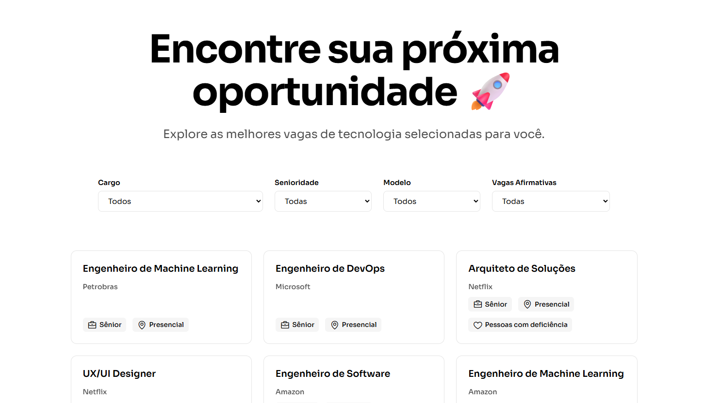

# [Vaggou](https://vaggou.vercel.app)

O Vaggou é um portal moderno de vagas, atualizado diarimaneto, voltado exclusivamente para o **ecossistema de tecnologia**.
Nosso objetivo é **conectar talentos a oportunidades reais, com transparência, clareza e foco na experiência do usuário**.

[](https://vaggou.vercel.app)

Além da listagem de vagas, oferecemos um recurso extra: a **JobLetters**, uma ferramenta onde o usuário informa seu número de WhatsApp e passa a **receber vagas diariamente no celular**, facilitando sua jornada profissional.

> [!NOTE]
> Este projeto foi desenvolvido como parte da [Global Solution](https://www.fiap.com.br/graduacao/global-solution) 2025/2 do 1º ano de Engenharia de Software da [FIAP](https://www.fiap.com.br/), dentro do tema **O Futuro do Trabalho**.

## Sumário

- [🎯 Objetivo do Projeto](#-objetivo-do-projeto)
- [🌍 Conexão com o Tema: O Futuro do Trabalho](#-conexão-com-o-tema--o-futuro-do-trabalho)
- [🧩 Funcionalidades do MVP](#-funcionalidades-do-mvp)
- [🔗 Deploy](#-deploy)
- [🖥️ Tecnologias Utilizadas](#️-tecnologias-utilizadas)
- [📁 Estrutura do Projeto](#-estrutura-do-projeto)
- [👥 Equipe](#-equipe)
- [🎥 Vídeo Pitch](#-vídeo-pitch)
- [👋 Finalização](#-finalização)


## 🎯 Objetivo do Projeto
Criar um **MVP funcional**, em **HTML, CSS e JavaScript**, capaz de:

- Ampliar oportunidades no futuro do trabalho;
- Promover inclusão produtiva;
- Facilitar o acesso a oportunidades de carreira;
- Utilizar tecnologia com impacto humano e social.

O Vaggou resolve uma dor real: **a busca por vagas atualizadas, confiáveis e organizadas para profissionais de tecnologia**.

## 🌍 Conexão com o Tema: O Futuro do Trabalho
Com o avanço da IA, automação e modelos híbridos, é essencial oferecer ferramentas que ajudem profissionais a navegar no novo mercado.  
O Vaggou contribui ao:

- Centralizar vagas reais e verificadas;
- Facilitar a requalificação ao aproximar talentos de oportunidades;
- Simplificar a jornada de quem busca emprego tech;
- Tornar a tecnologia um meio de inclusão e impacto positivo.

## 🧩 Funcionalidades do MVP
✔ Página inicial apresentando o problema e a proposta  
✔ Listagem de vagas (com busca e destaque)  

[](https://vaggou.vercel.app)

✔ Página JobLetters com cadastro via WhatsApp  

[](https://vaggou.vercel.app)

✔ Design responsivo (mobile e desktop)  
✔ Acessibilidade de página (modo escuro e modo claro)  
✔ Interações em JavaScript simulando funcionalidades  
✔ Navegação entre 3+ páginas  
✔ Protótipo funcional publicado (deploy)

## 🔗 Deploy
Acesse o protótipo hospedado: **https://vaggou.vercel.app**

## 🖥️ Tecnologias Utilizadas
- HTML5  
- CSS3  
- JavaScript (Vanilla)  
- Git / GitHub  
- Vercel (Deploy)
- Figma (Design)

## 📁 Estrutura do Projeto

```js
/public
   /pages
      index.html
      vagas.html
      sobre.html
      time.html
      contato.html
      jobsletter.html
   /scripts
      vagas.js
      menu-hamburguer.js
      jobsletter.js
      dark.js
      contato.js
   /styles
      style.css
   /images
      (... imagens usadas no projeto ...)
   /readme
      (... imagens usadas no readme ...)
   vagas.json
```

## 👥 Equipe

| Nome | RM | Função |
|------|-----|---------|
| Felipe Paiva | 567279 | Desenvolvimento, JS |
| Lucas Coelho | 566705 | Design, Figma |
| Matheus Audibert | 568080 | Desenvolvimento, UI/UX, JS |
| Ramon da Silva Martins | 566929 | Desenvolvimento, UI/UX, JS |
| Thiago Saccomani | 566731 | JS, Figma |

### 🎥 Vídeo Pitch

Vídeo Pitch demonstrando e explicando a solução: 

[](https://youtube.com/watch?v=G9PNoGMO2-4)

## 👋 Finalização

O **Vaggou** é nosso primeiro passo para tornar a busca por vagas tech mais simples, acessível e inclusiva.  
Seguimos evoluindo o projeto e trazendo melhorias contínuas.

_Obrigado por conhecer nossa solução!_